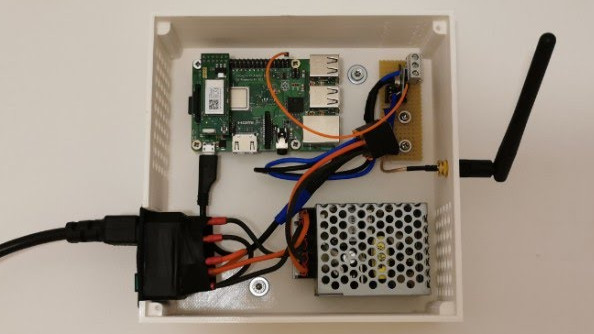

# Ragnar&oslash;k
* This repository is a collection of home automation related source and scripts.
* Why name it ragnar&oslash;k?<br/>Because once I'm fully dependent on an automated home, I'll be doomed.
* What's in here?
  * `helheimr` - A python3 systemd service to control our heating system. Highlights:
    * Task scheduling, temperature-aware controlling, etc.
    * ZigBee (via RaspBee) temperature sensors
    * LPD433 power plugs
    * Telegram bot
  * `breidablik` - TBD, e-ink display

## Sneak Peek
* Telegram bot to control `helheimr`:

  
* The RaspberryPi 3B+ running `helheimr`:

  
* The RaspberryPi running bilskirnir, TODO


## Installation Helheimr
Installation instructions on RaspberryPi 3B+:

* Download Raspbian (tested with [Buster lite](https://downloads.raspberrypi.org/raspbian_lite_latest), releases `2019-09-26` and `2020-02-13`)
  * Enable ssh (create empty `/boot/ssh` file)
  * (Optional) For convenience, add public key to `/home/pi/.ssh`, see https://www.raspberrypi.org/documentation/remote-access/ssh/passwordless.md, i.e. `cat ~/.ssh/id_rsa.pub | ssh <USERNAME>@<IP-ADDRESS> 'mkdir -p ~/.ssh && cat >> ~/.ssh/authorized_keys'`
  * Configure wifi via `/boot/wpa_supplicant.conf` (set country_code=.., update_config=1, etc.), see https://raspberrypi.stackexchange.com/a/57023
* Set up RaspBee (deCONZ, Phoscon) following their [setup guide](https://phoscon.de/en/raspbee/install#raspbian)
  * For convenience (and fear of trusting external websites):
    ```bash
    ### Enable serial interface
    sudo raspi-config
    # Interfacing Options => Serial
    # * Login shell over serial => No
    # * Enable serial port hardware => Yes

    # Reboot

    ### Install deCONZ via APT
    # Import public key
    wget -O - http://phoscon.de/apt/deconz.pub.key | sudo apt-key add -

    # Stable APT repository
    sudo sh -c "echo 'deb http://phoscon.de/apt/deconz \
            $(lsb_release -cs) main' > \
            /etc/apt/sources.list.d/deconz.list"

    # Install
    sudo apt update
    sudo apt install deconz

    # Ensure it is running
    sudo systemctl enable deconz-gui

    # Install realvnc to use the deconz-gui remotely (to easily do the
    # initial ZigBee network configuration)
    sudo apt install realvnc-vnc-server realvnc-vnc-viewer

    ### RPi 4 requires additional steps, check their guide!
    ```
  * Start deCONZ application and pair devices.
* Install software packages
  ```bash
  sudo apt install -y python3-dev python3-pip python3-venv libatlas-base-dev libjpeg-dev zlib1g-dev
  sudo -H pip3 install rpi-rf
  ```
* Checkout the source code and set up the virtual environment.
  * If some time in the future the newer packages would break the application, use the provided `frozen-requirements.txt` instead of `requirements.txt`, see `prepare_environment_py3.sh`
  * Bash script to set up the code base:
    ```bash
    git clone https://github.com/snototter/ragnaroek.git
    cd ragnaroek/helheimr
    ./prepare_environment_py3.sh

    # Install xkcd font (added some missing glyphs to the original xkcd-Script font)
    mkdir -p ~/.fonts
    cp ../assets/xkcd-Regular.otf ~/.fonts/
    fc-cache -f -v
    # Check if it's listed
    fc-list
    ```
* Prepare configuration files, place them into `<prj-root>/helheimr/configs/`:
  * `bot.cfg` - everything related to the Telegram bot
  * `ctrl.cfg` - heating, scheduling, logging, sensors, etc.
  * `owm.cfg` - OpenWeatherMap configuration
  * `scheduled-jobs.cfg` - (optional) pre-configure periodic heating/non-heating tasks
* Register and start the service:
  ```bash
  cd <prj-root>/helheimr/services
  ./install-service.sh

  ### Check logs:
  journalctl -f -u helheimr-heating.service
  ```
* Set up a cronjob to check WIFI connection (and reboot upon error), as RaspBerry Pi 3 seems to "frequently" (about once per month) loose wireless connection.
  * Create a script, e.g. `sudo vi /usr/local/bin/check-gateway-connection.sh` with
    ```bash
    #!/bin/bash --
    wake_time="06:30"
    sleep_time="23:00"
    known_ip=192.168.0.1

    # Time strings can be compared lexicographically: https://unix.stackexchange.com/a/395936
    currenttime=$(date +%H:%M)
    if [[ "$currenttime" > "${wake_time}" ]] && [[ "$currenttime" < "${sleep_time}" ]]; then
      ping -c4 ${known_ip} > /dev/null
       
      if [[ $? != 0 ]]; then
        echo "Cannot reach ip ${known_ip}, rebooting!" | systemd-cat -t helheimr -p warning
        sudo /sbin/shutdown -r +1
      fi
    fi
    ```
  * Adjust permissions: `sudo chmod 755 /usr/local/bin/check-gateway-connection.sh`
  * Add a cronjob, `crontab -e`, e.g. every 15 minutes:
    ```
    # Check that we're connected to the gateway
    */15 * * * * /usr/bin/sudo -H /usr/local/bin/check-gateway-connection.sh >> /dev/null 2>&1
    ```
  * Additionally, on Pi 3B+ we may run into [WIFI bounces](https://www.raspberrypi.org/forums/viewtopic.php?f=36&t=234058&start=50). To prevent this, add a cronjob to scan the WIFI every 2 minutes:
    ```
    # Explicitly trigger wpa_cli SCAN commands to prevent WIFI bounces
    */2 * * * * /usr/bin/sudo -H /sbin/wpa_cli -i wlan0 scan
    ```


## Installation Breidablik
Installation instructions on RaspberryPi 3B+:

* Download Raspbian (tested with Buster lite) - enable ssh, wifi, set up authorized keys, etc. (see Helheimr instructions above)
* Install the `BCM2835` library which provides access to GPIO and other IO functions:
  ```bash
  wget http://www.airspayce.com/mikem/bcm2835/bcm2835-1.62.tar.gz
  tar zxvf bcm2835-1.62.tar.gz 
  cd bcm2835-1.62/
  ./configure
  make
  sudo make check
  sudo make install
  ```
* Install packages
  ```bash
  sudo apt install wiringpi libopenjp2-7 libtiff5
  sudo apt install python3-dev python3-venv python3-pip libatlas-base-dev libjpeg-dev zlib1g-dev git python3-numpy
  sudo -H pip3 install wheel RPi.GPIO spidev Pillow
  ```
* Enable SPI interface via `sudo raspi-config` => Interfacing Options => SPI => Enable. Then, reboot.
* Connect e-ink display (see https://www.waveshare.com/wiki/4.2inch_e-Paper_Module, Pi pin numbers correspond to the enumerated board pins; BCM numbers correspond to the GPIO number):

  |Display|BCM2835|Pi 3b+|
  |:-----:|:-----:|:----:|
  |VCC    |3.3V   |  3.3V|
  |GND    |GND    |  GND |
  |DIN    |MOSI   |   19 |
  |CLK    |SCLK   |   23 |
  |CS     |CE0    |   24 |
  |DC     |25     |   22 |
  |RST    |17     |   11 |
  |BUSY   |24     |   18 |

* (Optional) Test e-ink paper
  ```bash
  git clone https://github.com/waveshare/e-Paper waveshare-eink
  cd waveshare-eink/cd RaspberryPi\&JetsonNano/c
  nano examples/main.c
  # Check that the correct test is enabled in main(), e.g. EPD_4in2_test();
  make
  ./epd
  
  # Python
  cd ../python
  # Fix the grayscale demo (as of February 2020, waveshare's epd4in2 is broken
  # due to missing cast/incorrect division operator)
  python3 examples/epd_4in2_test.py
  ```
* Checkout the source code and set up the virtual environment.
  * If some time in the future the newer packages would break the application, use the provided `frozen-requirements.txt` instead of `requirements.txt`, see `prepare_environment_py3.sh` TODO freeze package once deployed!
  * Bash script to set up the code base:
    ```bash
    git clone https://github.com/snototter/ragnaroek.git
    cd ragnaroek/breidablik
    ./prepare_environment_py3.sh
    ```
* Register and start the service
  ```bash
  cd <prj-root>/breidablik/services
  ./install-service.sh

  ### Check logs:
  journalctl -f -u breidablik-display.service
  ```

```
Pi pip packages
numpy==1.17.3
Pillow==6.2.1
pkg-resources==0.0.0
RPi.GPIO==0.7.0
spidev==3.4

Python EPD is incredibly slow (12-14 sec refresh), C is okay-ish (4 sec)
Have to try binding the C EPD implementation.


```

## TODOs
* [ ] REST API for e-ink display
* [ ] e-ink display tests
* [ ] e-ink cover
* [ ] pip freeze exact versions (breidablik)
* [ ] Restart helheimr upon deCONZ connection issues (I should've never started with the zigbee sensors, they're a pain at times...)

